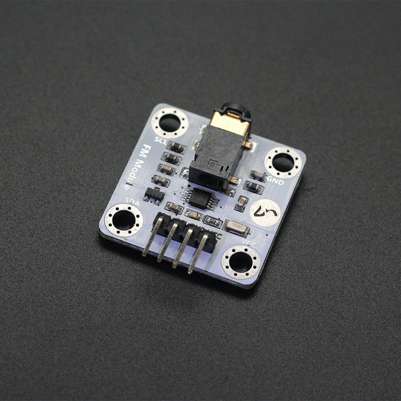

# Xindkj FM Radio

makecode xindkj FM module extension for micro:bit.  

Part of the drive base on fizban99's microbit OLED driver:  
https://github.com/fizban99/microbit_ssd1306  

Author: lz
Date:   2020.Mar  

  
  

## Add extension

open your microbit makecode project, in Extension, paste  

https://github.com/zl05101/pxt-FM_Radio

to search box then search, and click to add.  

## Basic usage

```
input.onButtonPressed(Button.A, function () {
    RDA5807M.seekUp()
})
RDA5807M.begin()
```

## API

- **begin()**  
initialize FM module.

- **volumeDown()**  
volume down

- **volumeUp()**  
volume up

- **seekUp()**  
seek up

- **seekDown()**  
seek down

## Demo

  


## License

MIT

Copyright (c) 2018, microbit/micropython Chinese community  

## Supported targets

* for PXT/microbit


[From microbit/micropython Chinese community](http://www.micropython.org.cn)
